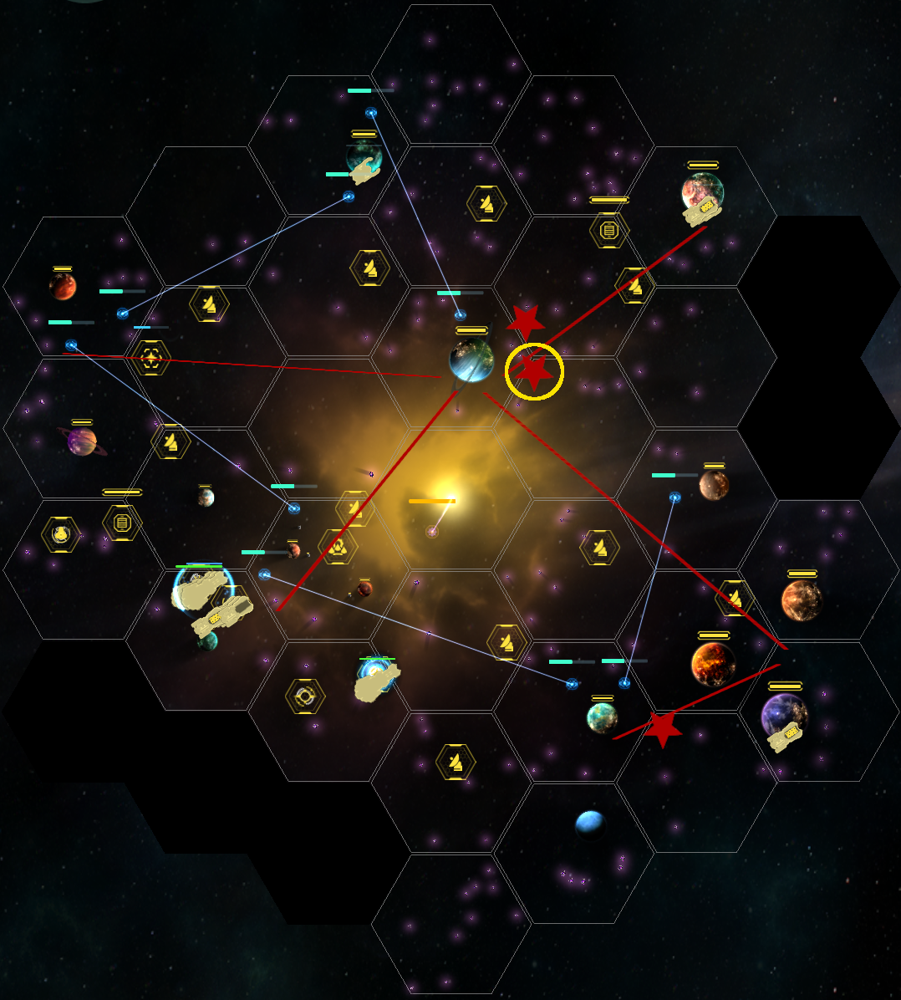

# Modules
- Offload (`Scarico`) at MAX for your level
- Shipment drone (`Drone da carico`) at MAX for your level
- Trade boost (`Potenziamento commercio`)
- Trade burst (`Potenziamento commercio`)
- Cargo bay extension (`Ampliamento stiva`) at MAX for your level

# Space stations
- Warp lane hub (`Hub corsia warp`) at MAX (number and level) for your level
- Trade station (`Stazione di scambio`) at MAX (number and level) for your level

# Transport ship

## Shipment transport ship
(minimum x3)

- Offload (`Scarico`)
- Trade boost (`Potenziamento commercio`)
- Trade burst (`Potenziamento commercio`)
- Cargo bay extension (`Ampliamento stiva`)

## Drone transport ship
- Shipment drone (`Drone da carico`)

# Star setup
The target is to right set up Warp lane hub (`Hub corsia warp`) to consume hydrogen as low as possible.  
Also you should have 1 Trade station (`Stazione di scambio`) as close as possible to a big planet (40 shipments at least).

**Legenda**
- red lines: optimized Warp lane hub (`Hub corsia warp`)
- red stars: Trade station (`Stazione di scambio`)
- yellow circle: the Trade station (`Stazione di scambio`) where to offload shipments to 

# The trick

## Rename all planets connected by warp lanes
- rename all planets connected by the Warp lane hub (`Hub corsia warp`), placing an `*` in the beginning (ex: `*Julmar`)  
- now you will see an `*` on all shipments for those planets

From planet shipments overview, you can now sort shipments by name and get shipments with `*` on top (or bottom). 

## Send one Transport on each zone
- send one Transport (or two) on each OUTSIDE zone the Warp lane hub (`Hub corsia warp`)
- load ALL the shipments from those planets
- bring the shipments on planets that are connected by the Warp lane hub (`Hub corsia warp`)
- DROP there shipments whit `*` (let the Shipment drone (`Drone da carico`) make deliveries for you)
- LOAD all shipments without `*` (not drone deliverable)
- bring shipments without `*` to the big planet close to the `yellow circle` (image above)
- look for a Transport ship with modules active (Offload (`Scarico`) and 2x Trade bonuses)
- offload all shipments without `*` to the `yellow circle` Trade station (`Stazione di scambio`)
- use just one Transport ship to offload all shipments to the Trade station (`Stazione di scambio`)
- turn on Time modulator (`Modulatore temporale`) to speed up travelling

### In this way you can have:
- drone bonus on `*` shipments
- trade bonuses on NO `*` shipments
- all planets empty of shipments
- low hydrogen consumption
- low time to get a full shipment round